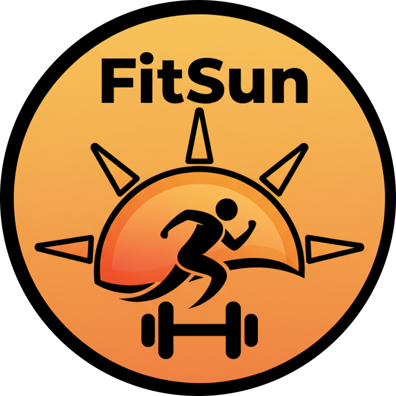
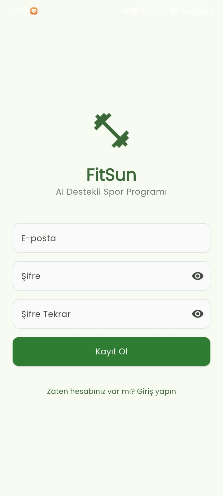
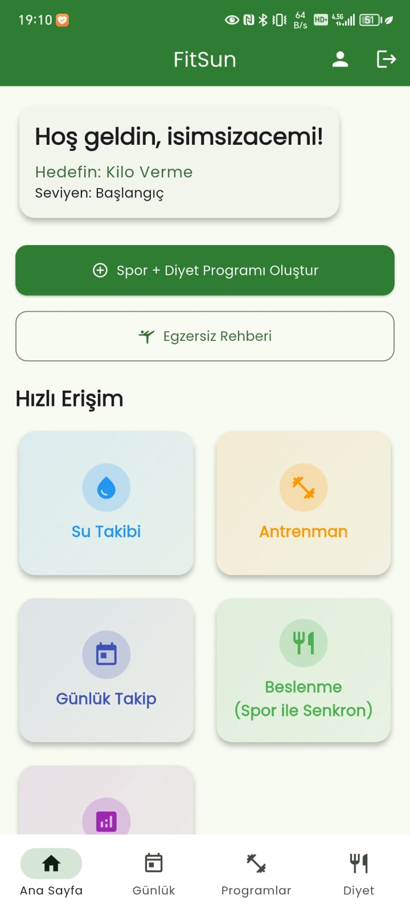
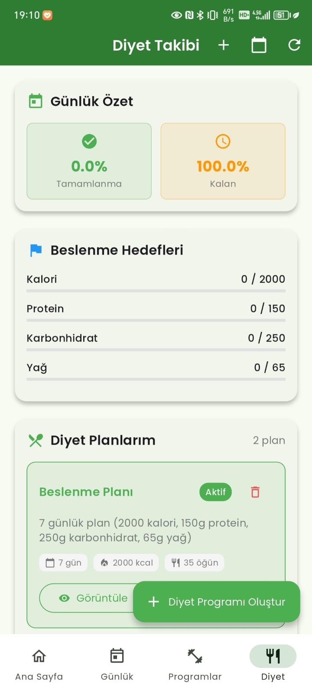
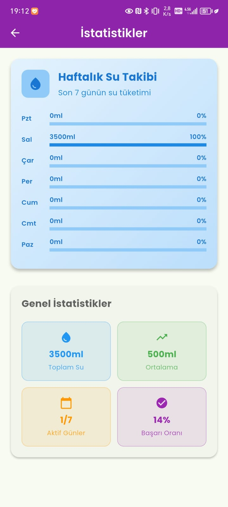
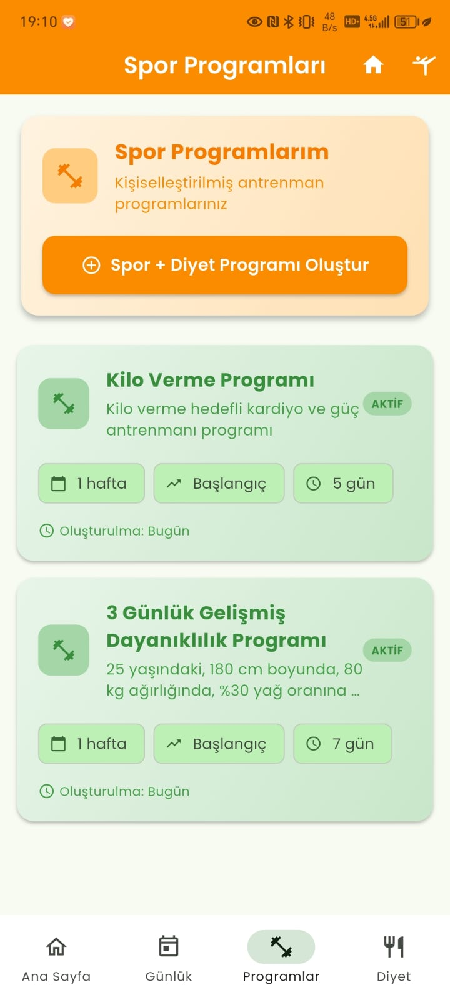

<<<<<<< HEAD
# 🏋️‍♂️ FitSun - AI-Powered Fitness Companion

<div align="center">
  
  
  
  
</div>

<div align="center">
  <h3>🏋️‍♂️ Kişiselleştirilmiş AI Destekli Fitness Uygulaması</h3>
  <p>Google Gemini AI ile özel antrenman ve beslenme programları oluşturun</p>
  
  [](https://github.com/isimsizacemi/fitsun)
</div>

## 📱 Uygulama Özellikleri

**🎯 16 Farklı Ekran** ile kapsamlı fitness deneyimi sunan FitSun, AI destekli kişiselleştirilmiş antrenman ve beslenme programları oluşturur.

### 🔐 Kullanıcı Yönetimi (3 Ekran)
- **🔑 Giriş Ekranı**: Firebase Authentication ile güvenli kimlik doğrulama
- **📝 Kayıt Ekranı**: Yeni kullanıcılar için basit ve hızlı hesap oluşturma
- **⚙️ Profil Düzenleme**: Kişisel bilgileri güncelleme, hedefleri değiştirme ve profil fotoğrafı yükleme

### 🤖 AI Destekli Program Oluşturma (2 Ekran)
- **🏋️‍♂️ Antrenman Programı Oluşturma**: Google Gemini AI ile kişiselleştirilmiş antrenman programları
- **🍽️ Beslenme Planı Oluşturma**: Hedeflerinize uygun 7 günlük detaylı beslenme programları
- **🎯 Akıllı Öneriler**: Yaş, kilo, boy, aktivite seviyesi ve hedeflere göre özelleştirilmiş öneriler

### 📊 Takip ve Analiz (6 Ekran)
- **💧 Su Takibi**: Günlük su tüketimi takibi ve hatırlatmalar
- **📈 Antrenman Geçmişi**: Tamamlanan antrenmanların listesi ve performans analizi
- **📊 Antrenman İstatistikleri**: Detaylı performans metrikleri ve süre analizi
- **📉 Antrenman Grafikleri**: Görsel ilerleme takibi ve trend analizi
- **🍽️ Beslenme Takibi**: Günlük kalori ve makro besin takibi
- **📱 Günlük Aktivite**: Adım sayısı, kalori yakımı ve aktivite kayıtları

### 🏋️‍♂️ Antrenman Detayları (3 Ekran)
- **📋 Program Detayları**: Oluşturulan programın haftalık görünümü ve egzersiz detayları
- **📖 Egzersiz Rehberi**: Kapsamlı egzersiz kütüphanesi ve doğru form teknikleri
- **💪 Egzersiz Detayları**: Tek bir egzersizin detaylı açıklaması ve kas grupları bilgisi

### 🍎 Beslenme Yönetimi (2 Ekran)
- **🍽️ Beslenme Ana Ekran**: Günlük kalori takibi ve makro besin analizi
- **📋 Diyet Detayları**: Günlük öğün listesi, besin değerleri ve kalori hesaplaması

## 🛠️ Teknoloji Stack'i

### Frontend
- **Flutter**: Cross-platform mobil uygulama geliştirme
- **Dart**: Programlama dili
- **Provider**: State management
- **Google Fonts**: Tipografi

### Backend & Services
- **Firebase Authentication**: Kullanıcı kimlik doğrulama
- **Cloud Firestore**: NoSQL veritabanı
- **Firebase Storage**: Dosya depolama
- **Google Gemini AI**: Yapay zeka destekli program oluşturma

### UI/UX
- **Material Design**: Modern ve kullanıcı dostu arayüz
- **Responsive Design**: Tüm ekran boyutlarına uyumlu
- **Dark/Light Theme**: Tema desteği

knka ## 📱 Uygulama Görünümü

<div align="center">
  
  
  <h4>🎯 Ana Özellikler</h4>
  
  <table>
    <tr>
      <td align="center">
        
        <br><strong>🔑 Giriş Ekranı</strong>
        <br><small>Firebase Authentication ile güvenli giriş</small>
      </td>
      <td align="center">
        
        <br><strong>📝 Kayıt Ekranı</strong>
        <br><small>Hızlı ve kolay hesap oluşturma</small>
      </td>
    </tr>
    <tr>
      <td align="center">
        
        <br><strong>🏠 Ana Dashboard</strong>
        <br><small>Kişiselleştirilmiş fitness merkezi</small>
      </td>
      <td align="center">
        
        <br><strong>⚙️ Profil Düzenleme</strong>
        <br><small>Kişisel bilgileri ve hedefleri güncelleme</small>
      </td>
    </tr>
    <tr>
      <td align="center">
        
        <br><strong>🤖 AI Program Oluşturma</strong>
        <br><small>Google Gemini AI ile kişiselleştirilmiş antrenman</small>
      </td>
      <td align="center">
        
        <br><strong>📋 Program Detayları</strong>
        <br><small>Haftalık görünüm ve egzersiz detayları</small>
      </td>
    </tr>
    <tr>
      <td align="center">
        
        <br><strong>📖 Egzersiz Rehberi</strong>
        <br><small>Kapsamlı egzersiz kütüphanesi</small>
      </td>
      <td align="center">
        
        <br><strong>💪 Egzersiz Detayları</strong>
        <br><small>Doğru form teknikleri ve kas grupları</small>
      </td>
    </tr>
    <tr>
      <td align="center">
        
        <br><strong>📈 Antrenman Geçmişi</strong>
        <br><small>Tamamlanan antrenmanlar ve performans analizi</small>
      </td>
      <td align="center">
        
        <br><strong>📊 Antrenman İstatistikleri</strong>
        <br><small>Detaylı performans metrikleri</small>
      </td>
    </tr>
    <tr>
      <td align="center">
        
        <br><strong>📉 Antrenman Grafikleri</strong>
        <br><small>Görsel ilerleme takibi ve trend analizi</small>
      </td>
      <td align="center">
        
        <br><strong>🍽️ Beslenme Ana Ekran</strong>
        <br><small>Günlük kalori ve makro besin takibi</small>
      </td>
    </tr>
    <tr>
      <td align="center">
        
        <br><strong>🎯 Diyet Planı Oluşturma</strong>
        <br><small>AI destekli beslenme planları</small>
      </td>
      <td align="center">
        
        <br><strong>📋 Diyet Detayları</strong>
        <br><small>Günlük öğün listesi ve besin değerleri</small>
      </td>
    </tr>
    <tr>
      <td align="center">
        
        <br><strong>💧 Günlük Takip</strong>
        <br><small>Su tüketimi ve aktivite takibi</small>
      </td>
      <td align="center">
        
        <br><strong>📊 İstatistikler</strong>
        <br><small>Detaylı analizler ve grafikler</small>
      </td>
    </tr>
    <tr>
      <td align="center" colspan="2">
        
        <br><strong>📚 Program Yönetimi</strong>
        <br><small>Tüm programlarınızı yönetin ve takip edin</small>
      </td>
    </tr>
  </table>
</div>

## ✨ Özellikler

### 🤖 AI Destekli Program Oluşturma
- **Google Gemini AI** - Kişiselleştirilmiş antrenman programları
- **Akıllı öneriler** - Yaş, kilo, boy, aktivite seviyesi ve hedeflere göre
- **Beslenme planları** - 7 günlük detaylı beslenme programları
- **Özel istekler** - Kullanıcı tercihlerine göre özelleştirme

### 📊 Kapsamlı Takip Sistemi
- **Antrenman geçmişi** - Tamamlanan antrenmanların detaylı kaydı
- **Performans analizi** - Süre, set, tekrar ve ilerleme takibi
- **Görsel grafikler** - Trend analizi ve hedef karşılaştırmaları
- **Su takibi** - Günlük su tüketimi ve hatırlatmalar

### 🍎 Beslenme Yönetimi
- **Kalori takibi** - Günlük kalori ve makro besin analizi
- **AI diyet planları** - Alerji ve kısıtlama tercihlerine göre
- **Besin değerleri** - Detaylı besin içeriği bilgileri
- **Öğün planlaması** - Kahvaltı, öğle, akşam ve ara öğünler

### 🏋️‍♂️ Antrenman Rehberi
- **Egzersiz kütüphanesi** - Kapsamlı egzersiz veritabanı
- **Form teknikleri** - Doğru egzersiz yapma rehberi
- **Kas grupları** - Hedeflenen kas grupları bilgisi
- **Alternatif egzersizler** - Farklı seviye ve ekipman seçenekleri

### 🔒 Güvenlik ve Gizlilik
- **Firebase Authentication** - Güvenli kimlik doğrulama
- **Veri şifreleme** - Kişisel bilgilerin korunması
- **Gizlilik kontrolü** - Veri paylaşım tercihleri
- **Güvenli depolama** - Cloud Firestore ile güvenli veri saklama

## 🚀 Kurulum ve Çalıştırma

### Gereksinimler
- Flutter SDK (3.8.1+)
- Dart SDK
- Android Studio / Xcode
- Firebase projesi
- Google Gemini AI API key'i

### Adım 1: Projeyi Klonlayın
```bash
git clone https://github.com/yourusername/fitsun-app.git
cd fitsun-app
```

### Adım 2: Bağımlılıkları Yükleyin
```bash
flutter pub get
```

### Adım 3: Firebase Konfigürasyonu
1. Firebase Console'da yeni proje oluşturun
2. Authentication, Firestore ve Storage'ı etkinleştirin
3. `google-services.json` (Android) ve `GoogleService-Info.plist` (iOS) dosyalarını indirin
4. Bu dosyaları ilgili klasörlere yerleştirin:
   - `android/app/google-services.json`
   - `ios/Runner/GoogleService-Info.plist`

### Adım 4: API Key Konfigürasyonu
1. Google AI Studio'dan Gemini API key'i alın
2. `lib/services/gemini_service.dart` dosyasında `YOUR_GEMINI_API_KEY_HERE` yerine gerçek key'inizi yazın

### Adım 5: Uygulamayı Çalıştırın
```bash
# Android için
flutter run

# iOS için
flutter run -d ios

# Web için
flutter run -d web
```

## 📁 Proje Yapısı

```
lib/
├── main.dart                 # Uygulama giriş noktası
├── models/                   # Veri modelleri
│   ├── user_model.dart
│   ├── workout_model.dart
│   ├── diet_plan.dart
│   └── ...
├── screens/                  # UI ekranları
│   ├── auth/
│   ├── home/
│   ├── workout/
│   ├── diet/
│   └── profile/
├── services/                 # İş mantığı servisleri
│   ├── auth_service.dart
│   ├── gemini_service.dart
│   ├── firebase_service.dart
│   └── ...
└── widgets/                  # Yeniden kullanılabilir widget'lar
```

## 🔧 Konfigürasyon

### Environment Variables
Uygulamayı çalıştırmadan önce aşağıdaki environment variable'ları ayarlayın:

```bash
# Firebase Project ID
export FIREBASE_PROJECT_ID=your-project-id

# Gemini AI API Key
export GEMINI_API_KEY=your-gemini-api-key
```

### Firebase Security Rules
Firestore ve Storage için güvenlik kuralları `firestore.rules` ve `storage.rules` dosyalarında tanımlanmıştır.

## 🤝 Katkıda Bulunma

1. Bu repository'yi fork edin
2. Feature branch oluşturun (`git checkout -b feature/amazing-feature`)
3. Değişikliklerinizi commit edin (`git commit -m 'Add amazing feature'`)
4. Branch'inizi push edin (`git push origin feature/amazing-feature`)
5. Pull Request oluşturun

## 📝 Lisans

Bu proje MIT lisansı altında lisanslanmıştır. Detaylar için `LICENSE` dosyasına bakın.

## 📱 APK İndirme

### 🚀 Hemen Deneyin!

Uygulamayı hemen denemek için APK dosyasını indirin:

[](releases/FitSun-v1.0.0.apk)

### 📋 Kurulum Adımları:

1. **APK'yı indirin** - Yukarıdaki butona tıklayın
2. **Bilinmeyen kaynaklara izin verin** - Ayarlar > Güvenlik > Bilinmeyen kaynaklar
3. **APK'yı yükleyin** - İndirilen dosyaya tıklayın
4. **Uygulamayı açın** - FitSun'i kullanmaya başlayın!

### 🔒 Güvenlik:
- APK dosyası güvenlidir
- Kaynak kodu açık
- Firebase ile güvenli kimlik doğrulama
- Kişisel verileriniz gizli tutulur

### 📊 APK Bilgileri:
- **Boyut**: ~55MB
- **Android Sürümü**: 5.0+ (API 21+)
- **Güncelleme Tarihi**: Son sürüm
- **Sürüm**: 1.0.0
- **Uygulama Adı**: FitSun

## 📊 Proje İstatistikleri

- **📱 Toplam Ekran Sayısı**: 16 farklı ekran
- **🔐 Kimlik Doğrulama**: 3 ekran
- **🏋️‍♂️ Antrenman Özellikleri**: 6 ekran
- **🍎 Beslenme Yönetimi**: 3 ekran
- **📊 Takip ve Analiz**: 4 ekran
- **🤖 AI Entegrasyonu**: Google Gemini AI
- **☁️ Backend**: Firebase (Auth, Firestore, Storage)
- **📱 Platform**: Cross-platform (Android, iOS, Web)

## 👨‍💻 Geliştirici

**Abdurrahman** - *Full Stack Developer*
- GitHub: [@yourusername](https://github.com/yourusername)
- LinkedIn: [Abdurrahman](https://linkedin.com/in/yourprofile)

## 🙏 Teşekkürler

- [Flutter](https://flutter.dev/) - Cross-platform framework
- [Firebase](https://firebase.google.com/) - Backend services
- [Google Gemini AI](https://ai.google.dev/) - AI capabilities
- [Material Design](https://material.io/) - Design system

## 📞 İletişim

Proje hakkında sorularınız için:
- Email: your.email@example.com
- LinkedIn: [Abdurrahman](https://linkedin.com/in/yourprofile)

---

<div align="center">

**⭐ Bu projeyi beğendiyseniz yıldız vermeyi unutmayın!**

Made with ❤️ by Abdurrahman

</div>
=======
# FitSun - AI Destekli Spor Programı Uygulaması

FitSun, kullanıcıların profil bilgilerine göre kişiselleştirilmiş spor programları oluşturan AI destekli mobil uygulamadır.

## 🚀 Özellikler

- 🔐 **Kullanıcı Kimlik Doğrulama**: Firebase Authentication ile güvenli giriş/kayıt
- 👤 **Profil Yönetimi**: Detaylı kullanıcı profili oluşturma ve düzenleme
- 🤖 **AI Destekli Program Oluşturma**: Google Gemini AI ile kişiselleştirilmiş spor programları
- 📱 **Modern UI/UX**: Material Design 3 ile modern ve kullanıcı dostu arayüz
- 🔥 **Firebase Entegrasyonu**: Firestore ile veri saklama ve senkronizasyon
- 🏋️ **Detaylı Egzersiz Programları**: Haftalık ve günlük antrenman planları

## 🛠️ Teknolojiler

### Frontend (Flutter)
- **Flutter** - Cross-platform mobil uygulama geliştirme
- **Firebase Auth** - Kullanıcı kimlik doğrulama
- **Cloud Firestore** - NoSQL veritabanı
- **Google Fonts** - Tipografi
- **Provider** - State management

### Backend (Node.js)
- **Express.js** - Web framework
- **Firebase Admin SDK** - Firebase backend entegrasyonu
- **Google Gemini AI** - AI spor programı oluşturma
- **CORS** - Cross-origin resource sharing

## 📋 Kurulum

### 1. Flutter Uygulaması

```bash
cd fitsun_app
flutter pub get
```

### 2. Backend Servisi

```bash
cd backend
npm install
```

### 3. Environment Variables

Backend için `.env` dosyası oluşturun:

```env
PORT=3000
FIREBASE_PROJECT_ID=your_project_id
FIREBASE_PRIVATE_KEY="your_private_key"
FIREBASE_CLIENT_EMAIL=your_client_email
GEMINI_API_KEY=your_gemini_api_key
```

## 🚀 Çalıştırma

### Backend Servisi
```bash
cd backend
npm start
# veya development için
npm run dev
```

### Flutter Uygulaması
```bash
cd fitsun_app
flutter run
```

## 📱 Kullanım

1. **Kayıt/Giriş**: E-posta ve şifre ile hesap oluşturun veya giriş yapın
2. **Profil Oluşturma**: Yaş, boy, kilo, cinsiyet, hedef, spor seviyesi ve ekipman bilgilerinizi girin
3. **Program Oluşturma**: "Yeni Program Oluştur" butonuna tıklayarak AI destekli spor programınızı oluşturun
4. **Program Görüntüleme**: Haftalık ve günlük antrenman planlarınızı inceleyin

## 🏗️ Proje Yapısı

```
fitSun/
├── fitsun_app/                 # Flutter uygulaması
│   ├── lib/
│   │   ├── models/            # Veri modelleri
│   │   ├── screens/           # UI ekranları
│   │   ├── services/          # API servisleri
│   │   ├── widgets/           # Özel widget'lar
│   │   └── utils/             # Yardımcı fonksiyonlar
│   ├── android/               # Android konfigürasyonu
│   └── ios/                   # iOS konfigürasyonu
└── backend/                   # Node.js backend
    ├── server.js              # Ana server dosyası
    ├── package.json           # NPM bağımlılıkları
    └── README.md              # Backend dokümantasyonu
```

## 🔧 API Endpoints

### Backend API

- `GET /` - Ana sayfa
- `POST /api/generate-workout` - Spor programı oluşturma
- `GET /api/health` - Sağlık kontrolü

## 📝 Geliştirme Notları

- Firebase konfigürasyon dosyaları (`google-services.json`, `GoogleService-Info.plist`) örnek dosyalardır
- Gerçek Firebase projesi oluşturup konfigürasyon dosyalarını güncelleyin
- Gemini API anahtarınızı backend `.env` dosyasına ekleyin
- CORS ayarlarını production için güncelleyin

## 🤝 Katkıda Bulunma

1. Fork yapın
2. Feature branch oluşturun (`git checkout -b feature/amazing-feature`)
3. Commit yapın (`git commit -m 'Add amazing feature'`)
4. Push yapın (`git push origin feature/amazing-feature`)
5. Pull Request oluşturun

## 📄 Lisans

Bu proje MIT lisansı altında lisanslanmıştır.

## 📞 İletişim

Proje hakkında sorularınız için issue açabilirsiniz.

---

**Not**: Bu uygulama geliştirme amaçlıdır. Production kullanımı için güvenlik ve performans optimizasyonları yapılmalıdır.
>>>>>>> 33cc310b69a5403b69427bf52773497b0eda78ee
