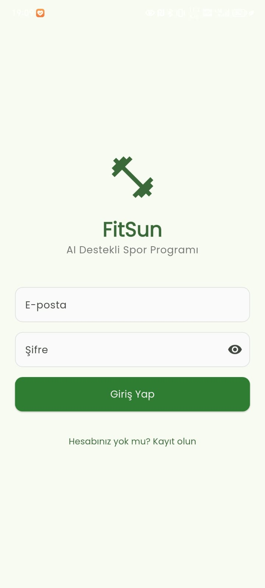

<<<<<<< HEAD
# 🏋️‍♂️ FitSun - AI-Powered Fitness Companion

<div align="center">


**Kişiselleştirilmiş AI destekli fitness ve beslenme uygulaması**

[](https://flutter.dev/)
[](https://firebase.google.com/)
[](https://ai.google.dev/)

</div>

## 📱 Uygulama Özellikleri

**🎯 16 Farklı Ekran** ile kapsamlı fitness deneyimi sunan FitSun, AI destekli kişiselleştirilmiş antrenman ve beslenme programları oluşturur.

### 🔐 Kullanıcı Yönetimi (3 Ekran)
- **🔑 Giriş Ekranı**: Firebase Authentication ile güvenli kimlik doğrulama
- **📝 Kayıt Ekranı**: Yeni kullanıcılar için basit ve hızlı hesap oluşturma
- **⚙️ Profil Düzenleme**: Kişisel bilgileri güncelleme, hedefleri değiştirme ve profil fotoğrafı yükleme

### 🤖 AI Destekli Program Oluşturma (2 Ekran)
- **🏋️‍♂️ Antrenman Programı Oluşturma**: Google Gemini AI ile kişiselleştirilmiş antrenman programları
- **🍽️ Beslenme Planı Oluşturma**: Hedeflerinize uygun 7 günlük detaylı beslenme programları
- **🎯 Akıllı Öneriler**: Yaş, kilo, boy, aktivite seviyesi ve hedeflere göre özelleştirilmiş öneriler

### 📊 Takip ve Analiz (6 Ekran)
- **💧 Su Takibi**: Günlük su tüketimi takibi ve hatırlatmalar
- **📈 Antrenman Geçmişi**: Tamamlanan antrenmanların listesi ve performans analizi
- **📊 Antrenman İstatistikleri**: Detaylı performans metrikleri ve süre analizi
- **📉 Antrenman Grafikleri**: Görsel ilerleme takibi ve trend analizi
- **🍽️ Beslenme Takibi**: Günlük kalori ve makro besin takibi
- **📱 Günlük Aktivite**: Adım sayısı, kalori yakımı ve aktivite kayıtları

### 🏋️‍♂️ Antrenman Detayları (3 Ekran)
- **📋 Program Detayları**: Oluşturulan programın haftalık görünümü ve egzersiz detayları
- **📖 Egzersiz Rehberi**: Kapsamlı egzersiz kütüphanesi ve doğru form teknikleri
- **💪 Egzersiz Detayları**: Tek bir egzersizin detaylı açıklaması ve kas grupları bilgisi

### 🍎 Beslenme Yönetimi (2 Ekran)
- **🍽️ Beslenme Ana Ekran**: Günlük kalori takibi ve makro besin analizi
- **📋 Diyet Detayları**: Günlük öğün listesi, besin değerleri ve kalori hesaplaması

## 🛠️ Teknoloji Stack'i

### Frontend
- **Flutter**: Cross-platform mobil uygulama geliştirme
- **Dart**: Programlama dili
- **Provider**: State management
- **Google Fonts**: Tipografi

### Backend & Services
- **Firebase Authentication**: Kullanıcı kimlik doğrulama
- **Cloud Firestore**: NoSQL veritabanı
- **Firebase Storage**: Dosya depolama
- **Google Gemini AI**: Yapay zeka destekli program oluşturma

### UI/UX
- **Material Design**: Modern ve kullanıcı dostu arayüz
- **Responsive Design**: Tüm ekran boyutlarına uyumlu
- **Dark/Light Theme**: Tema desteği

## 📸 Ekran Görüntüleri

### 🔐 Kimlik Doğrulama Ekranları
<div align="center">

| Giriş Yapma | Kayıt Olma | Profil Düzenleme |
|-------------|------------|------------------|
|  |  |  |

</div>

**🔑 Giriş Ekranı**: Firebase Authentication ile güvenli giriş yapma. Email ve şifre ile kolay erişim.
**📝 Kayıt Ekranı**: Yeni kullanıcılar için hesap oluşturma. Basit ve hızlı kayıt süreci.
**⚙️ Profil Düzenleme**: Kişisel bilgileri güncelleme, hedefleri değiştirme ve profil fotoğrafı yükleme.

### 🏠 Ana Ekranlar
<div align="center">

| Ana Dashboard | İstatistikler |
|---------------|---------------|
|  |  |

</div>

**🏠 Ana Dashboard**: Kullanıcı karşılama, aktif program özeti, hızlı erişim kartları ve günlük hedefler.
**📊 İstatistikler**: Detaylı analizler, kilo değişimi grafikleri, su tüketimi ve antrenman sıklığı takibi.

### 🏋️‍♂️ Antrenman Özellikleri
<div align="center">

| AI Program Oluşturma | Program Detayları | Egzersiz Rehberi |
|----------------------|-------------------|------------------|
|  |  |  |

</div>

**🤖 AI Program Oluşturma**: Google Gemini AI ile kişiselleştirilmiş antrenman programları. Hedef, seviye ve ekipman tercihlerine göre özel programlar.
**📋 Program Detayları**: Oluşturulan programın haftalık görünümü, egzersiz detayları, set-tekrar bilgileri ve program yönetimi.
**📖 Egzersiz Rehberi**: Kapsamlı egzersiz kütüphanesi, doğru form teknikleri ve kas grupları bilgisi.

### 🏋️‍♂️ Antrenman Takibi
<div align="center">

| Antrenman Geçmişi | Antrenman İstatistikleri | Antrenman Grafikleri |
|-------------------|-------------------------|---------------------|
|  |  |  |

</div>

**📈 Antrenman Geçmişi**: Tamamlanan antrenmanların listesi, performans analizi ve ilerleme takibi.
**📊 Antrenman İstatistikleri**: Detaylı performans metrikleri, süre analizi ve başarı oranları.
**📉 Antrenman Grafikleri**: Görsel ilerleme takibi, trend analizi ve hedef karşılaştırmaları.

### 🍎 Beslenme Özellikleri
<div align="center">

| Beslenme Ana Ekran | Diyet Planı Oluşturma | Diyet Detayları |
|-------------------|----------------------|-----------------|
|  |  |  |

</div>

**🍽️ Beslenme Ana Ekran**: Günlük kalori takibi, makro besin analizi ve beslenme istatistikleri.
**🎯 Diyet Planı Oluşturma**: AI destekli beslenme planları, alerji/kısıtlama tercihleri ve hedef kalori belirleme.
**📋 Diyet Detayları**: Günlük öğün listesi, besin değerleri, kalori hesaplaması ve beslenme takibi.

### 📊 Günlük Takip
<div align="center">

| Su Takibi ve Günlük Aktivite |
|------------------------------|
|  |

</div>

**💧 Su Takibi**: Günlük su tüketimi takibi, hatırlatmalar ve hedef takibi.
**📱 Günlük Aktivite**: Adım sayısı, kalori yakımı ve aktivite kayıtları.

### 🎯 Program Yönetimi
<div align="center">

| Program Listesi | Program Oluşturma (Alternatif) |
|-----------------|--------------------------------|
|  |  |

</div>

**📚 Program Listesi**: Kullanıcının tüm programları, aktif/pasif durumları ve program yönetimi.
**🔄 Program Oluşturma**: Alternatif program oluşturma arayüzü, gelişmiş tercih seçenekleri.

### 🏃‍♂️ Egzersiz Detayları
<div align="center">

| Egzersiz Nasıl Yapılır |
|------------------------|
|  |

</div>

**💪 Egzersiz Detayları**: Tek bir egzersizin detaylı açıklaması, doğru form teknikleri, hedeflenen kas grupları ve alternatif egzersizler.

## 🚀 Kurulum ve Çalıştırma

### Gereksinimler
- Flutter SDK (3.8.1+)
- Dart SDK
- Android Studio / Xcode
- Firebase projesi
- Google Gemini AI API key'i

### Adım 1: Projeyi Klonlayın
```bash
git clone https://github.com/yourusername/fitsun-app.git
cd fitsun-app
```

### Adım 2: Bağımlılıkları Yükleyin
```bash
flutter pub get
```

### Adım 3: Firebase Konfigürasyonu
1. Firebase Console'da yeni proje oluşturun
2. Authentication, Firestore ve Storage'ı etkinleştirin
3. `google-services.json` (Android) ve `GoogleService-Info.plist` (iOS) dosyalarını indirin
4. Bu dosyaları ilgili klasörlere yerleştirin:
   - `android/app/google-services.json`
   - `ios/Runner/GoogleService-Info.plist`

### Adım 4: API Key Konfigürasyonu
1. Google AI Studio'dan Gemini API key'i alın
2. `lib/services/gemini_service.dart` dosyasında `YOUR_GEMINI_API_KEY_HERE` yerine gerçek key'inizi yazın

### Adım 5: Uygulamayı Çalıştırın
```bash
# Android için
flutter run

# iOS için
flutter run -d ios

# Web için
flutter run -d web
```

## 📁 Proje Yapısı

```
lib/
├── main.dart                 # Uygulama giriş noktası
├── models/                   # Veri modelleri
│   ├── user_model.dart
│   ├── workout_model.dart
│   ├── diet_plan.dart
│   └── ...
├── screens/                  # UI ekranları
│   ├── auth/
│   ├── home/
│   ├── workout/
│   ├── diet/
│   └── profile/
├── services/                 # İş mantığı servisleri
│   ├── auth_service.dart
│   ├── gemini_service.dart
│   ├── firebase_service.dart
│   └── ...
└── widgets/                  # Yeniden kullanılabilir widget'lar
```

## 🔧 Konfigürasyon

### Environment Variables
Uygulamayı çalıştırmadan önce aşağıdaki environment variable'ları ayarlayın:

```bash
# Firebase Project ID
export FIREBASE_PROJECT_ID=your-project-id

# Gemini AI API Key
export GEMINI_API_KEY=your-gemini-api-key
```

### Firebase Security Rules
Firestore ve Storage için güvenlik kuralları `firestore.rules` ve `storage.rules` dosyalarında tanımlanmıştır.

## 🤝 Katkıda Bulunma

1. Bu repository'yi fork edin
2. Feature branch oluşturun (`git checkout -b feature/amazing-feature`)
3. Değişikliklerinizi commit edin (`git commit -m 'Add amazing feature'`)
4. Branch'inizi push edin (`git push origin feature/amazing-feature`)
5. Pull Request oluşturun

## 📝 Lisans

Bu proje MIT lisansı altında lisanslanmıştır. Detaylar için `LICENSE` dosyasına bakın.

## 📊 Proje İstatistikleri

- **📱 Toplam Ekran Sayısı**: 16 farklı ekran
- **🔐 Kimlik Doğrulama**: 3 ekran
- **🏋️‍♂️ Antrenman Özellikleri**: 6 ekran
- **🍎 Beslenme Yönetimi**: 3 ekran
- **📊 Takip ve Analiz**: 4 ekran
- **🤖 AI Entegrasyonu**: Google Gemini AI
- **☁️ Backend**: Firebase (Auth, Firestore, Storage)
- **📱 Platform**: Cross-platform (Android, iOS, Web)

## 👨‍💻 Geliştirici

**Abdurrahman** - *NO Developer*
- GitHub: (https://github.com/isimsizacemi)
- LinkedIn: [Abdurrahman](https://www.linkedin.com/in/abdurrahman-özkan-155a58228)

## 🙏 Teşekkürler

- [Flutter](https://flutter.dev/) - Cross-platform framework
- [Firebase](https://firebase.google.com/) - Backend services
- [Google Gemini AI](https://ai.google.dev/) - AI capabilities
- [Material Design](https://material.io/) - Design system

## 📞 İletişim

Proje hakkında sorularınız için:
- Email: abdurrahman19ozkan@gmail.com
- LinkedIn: [Abdurrahman](https://www.linkedin.com/in/abdurrahman-özkan-155a58228)

---

<div align="center">

**⭐ Bu projeyi beğendiyseniz yıldız vermeyi unutmayın!**

Made with ❤️ by Abdurrahman

</div>
=======
# FitSun - AI Destekli Spor Programı Uygulaması

FitSun, kullanıcıların profil bilgilerine göre kişiselleştirilmiş spor programları oluşturan AI destekli mobil uygulamadır.

## 🚀 Özellikler

- 🔐 **Kullanıcı Kimlik Doğrulama**: Firebase Authentication ile güvenli giriş/kayıt
- 👤 **Profil Yönetimi**: Detaylı kullanıcı profili oluşturma ve düzenleme
- 🤖 **AI Destekli Program Oluşturma**: Google Gemini AI ile kişiselleştirilmiş spor programları
- 📱 **Modern UI/UX**: Material Design 3 ile modern ve kullanıcı dostu arayüz
- 🔥 **Firebase Entegrasyonu**: Firestore ile veri saklama ve senkronizasyon
- 🏋️ **Detaylı Egzersiz Programları**: Haftalık ve günlük antrenman planları

## 🛠️ Teknolojiler

### Frontend (Flutter)
- **Flutter** - Cross-platform mobil uygulama geliştirme
- **Firebase Auth** - Kullanıcı kimlik doğrulama
- **Cloud Firestore** - NoSQL veritabanı
- **Google Fonts** - Tipografi
- **Provider** - State management

### Backend (Node.js)
- **Express.js** - Web framework
- **Firebase Admin SDK** - Firebase backend entegrasyonu
- **Google Gemini AI** - AI spor programı oluşturma
- **CORS** - Cross-origin resource sharing

## 📋 Kurulum

### 1. Flutter Uygulaması

```bash
cd fitsun_app
flutter pub get
```

### 2. Backend Servisi

```bash
cd backend
npm install
```

### 3. Environment Variables

Backend için `.env` dosyası oluşturun:

```env
PORT=3000
FIREBASE_PROJECT_ID=your_project_id
FIREBASE_PRIVATE_KEY="your_private_key"
FIREBASE_CLIENT_EMAIL=your_client_email
GEMINI_API_KEY=your_gemini_api_key
```

## 🚀 Çalıştırma

### Backend Servisi
```bash
cd backend
npm start
# veya development için
npm run dev
```

### Flutter Uygulaması
```bash
cd fitsun_app
flutter run
```

## 📱 Kullanım

1. **Kayıt/Giriş**: E-posta ve şifre ile hesap oluşturun veya giriş yapın
2. **Profil Oluşturma**: Yaş, boy, kilo, cinsiyet, hedef, spor seviyesi ve ekipman bilgilerinizi girin
3. **Program Oluşturma**: "Yeni Program Oluştur" butonuna tıklayarak AI destekli spor programınızı oluşturun
4. **Program Görüntüleme**: Haftalık ve günlük antrenman planlarınızı inceleyin

## 🏗️ Proje Yapısı

```
fitSun/
├── fitsun_app/                 # Flutter uygulaması
│   ├── lib/
│   │   ├── models/            # Veri modelleri
│   │   ├── screens/           # UI ekranları
│   │   ├── services/          # API servisleri
│   │   ├── widgets/           # Özel widget'lar
│   │   └── utils/             # Yardımcı fonksiyonlar
│   ├── android/               # Android konfigürasyonu
│   └── ios/                   # iOS konfigürasyonu
└── backend/                   # Node.js backend
    ├── server.js              # Ana server dosyası
    ├── package.json           # NPM bağımlılıkları
    └── README.md              # Backend dokümantasyonu
```

## 🔧 API Endpoints

### Backend API

- `GET /` - Ana sayfa
- `POST /api/generate-workout` - Spor programı oluşturma
- `GET /api/health` - Sağlık kontrolü

## 📝 Geliştirme Notları

- Firebase konfigürasyon dosyaları (`google-services.json`, `GoogleService-Info.plist`) örnek dosyalardır
- Gerçek Firebase projesi oluşturup konfigürasyon dosyalarını güncelleyin
- Gemini API anahtarınızı backend `.env` dosyasına ekleyin
- CORS ayarlarını production için güncelleyin

## 🤝 Katkıda Bulunma

1. Fork yapın
2. Feature branch oluşturun (`git checkout -b feature/amazing-feature`)
3. Commit yapın (`git commit -m 'Add amazing feature'`)
4. Push yapın (`git push origin feature/amazing-feature`)
5. Pull Request oluşturun

## 📄 Lisans

Bu proje MIT lisansı altında lisanslanmıştır.

## 📞 İletişim

Proje hakkında sorularınız için issue açabilirsiniz.

---

**Not**: Bu uygulama geliştirme amaçlıdır. Production kullanımı için güvenlik ve performans optimizasyonları yapılmalıdır.
>>>>>>> 33cc310b69a5403b69427bf52773497b0eda78ee
